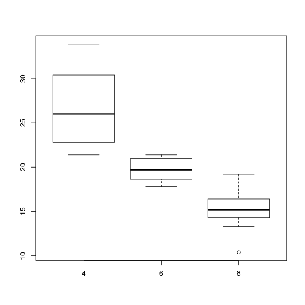

Comsumption Predictor (miles per gallon)
========================================================
author: Òscar Ochoa 
date: 26 July 2015
width: 1440
height: 900

Introduction
========================================================
This application shows the boxplot and the graph of the linear model of the selected variable and the 'miles per gallon' variable (mpg).

The app is very intuitive as you only need to select the variable you want. You get a lot of information about the relationship with 'mpg'.

- Select the variable you want to use for the consumption prediction.
- Check if you want to include the outliers.
- Use the graphics as a Exploratory Data Tool.
- In the Data tab you will find out the details of the linear model.

Exploratory Data Graphics
========================================================
Two kind of graphs are performed: one  boxplot as you can see below, and the linear model between both variables (mpg and the selected one)

 

Prediction (Data tab)
========================================================
If you are interested the app can show you the data generated by a linear model prediction between any of the variables available. Some of the variables inluded are:

- Residuals
- R-Squared
- Intercept
- ...

Example of output
========================================================


```

Call:
lm(formula = mpg ~ wt, data = my_data)

Residuals:
    Min      1Q  Median      3Q     Max 
-4.5432 -2.3647 -0.1252  1.4096  6.8727 

Coefficients:
            Estimate Std. Error t value Pr(>|t|)    
(Intercept)  37.2851     1.8776  19.858  < 2e-16 ***
wt           -5.3445     0.5591  -9.559 1.29e-10 ***
---
Signif. codes:  0 '***' 0.001 '**' 0.01 '*' 0.05 '.' 0.1 ' ' 1

Residual standard error: 3.046 on 30 degrees of freedom
Multiple R-squared:  0.7528,	Adjusted R-squared:  0.7446 
F-statistic: 91.38 on 1 and 30 DF,  p-value: 1.294e-10
```
